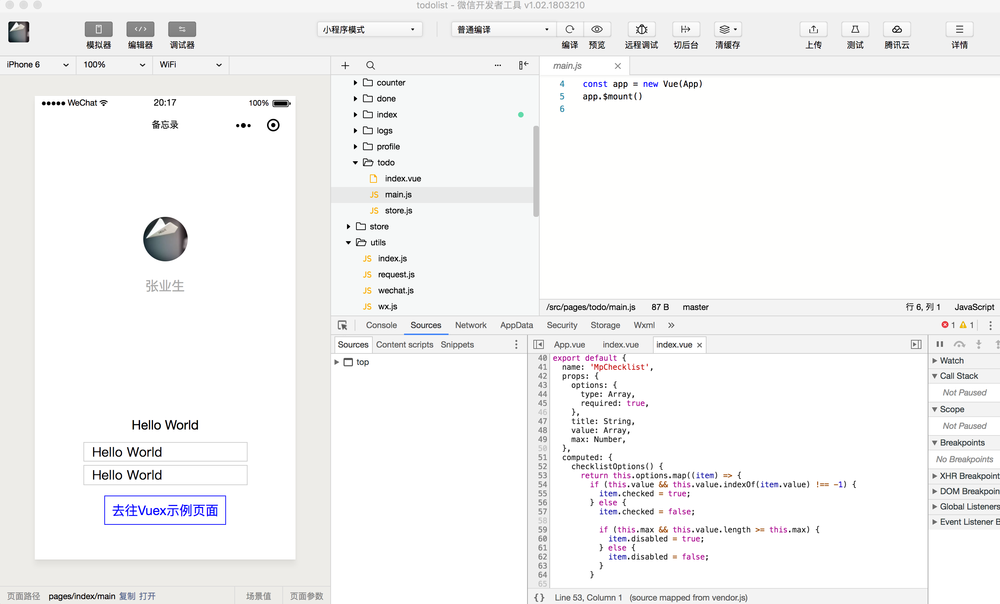
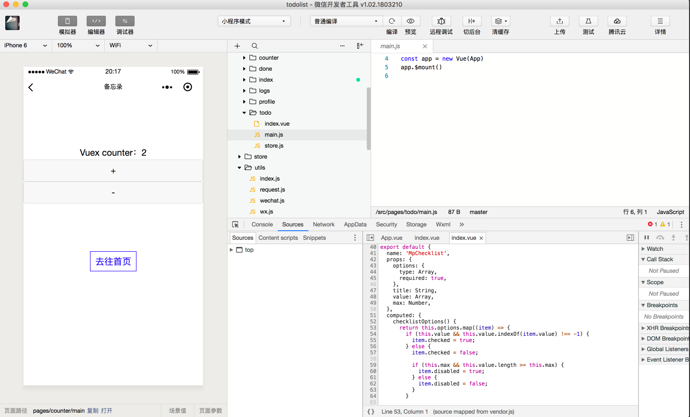

# Mpvue + Vuex + MongoDB + Express

随着小程序的持续发酵，用来开发小程序的框架也越来越多；从原生到WePY到Mpvue再到最近刚开源的Taro各有各的特点。
简单看下上面提到的三个框架：

- [WePY](https://github.com/Tencent/wepy): 让小程序支持组件化开发的框架
  - 官方出品
  - 类Vue.js语法
- [Mpvue](https://github.com/Meituan-Dianping/mpvue): 是一个使用Vue.js开发小程序的前端框架
  - 美团出品
  - Vue.js语法
- [Taro](https://github.com/NervJS/taro): 一套遵循React语法规范的多端开发解决方案
  - [凹凸实验室](https://aotu.io)出品
  - React语法
  - 一套代码适配多端(小程序/H5/ReactNative...)

关于WePY和Mpvue更详细的对比可以看[这里](https://github.com/wuweijia/wuweijia.github.io/issues/32)

这里看下使用Mpvue做一个简单的TODOLIST小程序；从服务器、域名、SSL证书开始到提交线上版本发布小程序，一步一步把过程记录下来。

## 目录

- 微信公众平台
- 小程序开发
  - mpvue
  - vuex
  - wecaht
  - request
- 服务器
- 域名
- SSL证书
- Nginx
- api服务

### 微信公众平台

> 开发小程序的第一步，你需要拥有一个小程序帐号，通过这个帐号你就可以管理你的小程序。

1、到微信公众平台上[注册小程序](https://mp.weixin.qq.com/wxopen/waregister?action=step1)，获得小程序的AppID(小程序ID)、AppSecret(小程序密钥)等信息。详细步骤参考[小程序开发文档|起步](https://developers.weixin.qq.com/miniprogram/dev/)。

2、有了小程序开发者账号之后，需要下载[微信开发者工具](https://developers.weixin.qq.com/miniprogram/dev/devtools/download.html?t=2018712)。

3、用微信开发者工具创建一个小程序项目，点击开发者工具的编译按钮即可以看到一个官方Demo啦。详细步骤参考[我的第一个小程序](https://developers.weixin.qq.com/miniprogram/dev/quickstart/basic/getting-started.html#%E4%BD%A0%E7%9A%84%E7%AC%AC%E4%B8%80%E4%B8%AA%E5%B0%8F%E7%A8%8B%E5%BA%8F)

## 小程序开发

这里将采用Mpvue这个框架进行开发；结合Vuex进行状态管理，简单封装微信的内置api。

### Mpvue

> [mpvue](http://mpvue.com/)是一个使用Vue.js开发小程序的前端框架。框架基于Vue.js核心，mpvue修改了Vue.js的runtime和compiler实现，使其可以运行在小程序环境中，从而为小程序开发引入了整套Vue.js开发体验。

1、初始化项目

```shell
# 全局安装 vue-cli
$ npm install --global vue-cli

# 创建一个基于 mpvue-quickstart 模板的新项目: todolist
$ vue init mpvue/mpvue-quickstart todolist

# 安装依赖
$ cd todolist
$ npm install
# 启动构建
$ npm run dev
```

成功启动后，打开微信开发者工具，引入项目(项目目录)即可看到第一个Mpvue小程序啦。

Mpvue示例小程序：

下面这个Counter是Vuex的示例：


### Vuex

> [Vuex](https://vuex.vuejs.org/zh/) 是一个专为Vue.js应用程序开发的状态管理模式，它采用集中式存储管理应用的所有组件的状态，并以相应的规则保证状态以一种可预测的方式发生变化。

Vuex的作用就是用来管理不同的组件之间的状态数据。Vuex并不是必须使用的，如果应用足够简单的话可以直接使用Prop进行数据传递会更加方便快捷。关于该什么时候使用vuex，可以看看[官方的解释](https://vuex.vuejs.org/zh/#%E4%BB%80%E4%B9%88%E6%83%85%E5%86%B5%E4%B8%8B%E6%88%91%E5%BA%94%E8%AF%A5%E4%BD%BF%E7%94%A8-vuex%EF%BC%9F)。

Vuex的核心概念有：State、Getter、Mutation、Action、Module。

1、[State](https://vuex.vuejs.org/zh/guide/state.html)
state里面存储了所有状态数据，不同的module之间可以通过rootState获取数据。

```javascript
// todo/store.js
const state = {
  todoList: [],
  userInfo: {}
}

// done/store.js
const state = {
  doneList: []
}

const mutations = {  // mutation用来更新状态值
  setDoneList(state, { doneList }) {
    state.doneList = doneList
  }
}

const actions = {
  listTodo({ state, commit, rootState }) {
    const todoList = rootState.todo.todoList  // actions里面通过rootState即可访问到done/store.js的state了
    const doneList = todoList.filter(todo => todo.status === 2)
    commit('setDoneList', { doneList })  // 用commit来调用mutation里面的方法，进行更新状态
  }
}
```

在`done/store.js`的actions里面通过rootState即可访问到所有的state了，如果要改变state里面的值，使用mutation进行操作。

2、[Getter](https://vuex.vuejs.org/zh/guide/getters.html)
getter可以简单的理解为用来做中间过滤操作的。

```javascript
// todo/store.js
const state = {
  todoList: [],
  userInfo: {}
}

const getters = {
  doneTodos: state => {
    return state.todoList.filter(todo => todo.status === 2)
  }
}
```

通过属性访问getter就可以调用了。

3、[Mutation](https://vuex.vuejs.org/zh/guide/mutations.html)
更改Vuex的store中的状态的唯一方法是提交mutation。也就是说要更改状态，必须是通提交mutation，但是要注意Mutation[不支持异步函数](https://vuex.vuejs.org/zh/guide/mutations.html#mutation-%E5%BF%85%E9%A1%BB%E6%98%AF%E5%90%8C%E6%AD%A5%E5%87%BD%E6%95%B0)。

```javascript
// todo/store.js
const state = {
  todoList: [],
  userInfo: {}
}

const mutations = {
  setTodoList: (state, { todoList }) {
    state.todoList = todoList
    /*
    // 在异步函数的回调中更新状态，让状态变得不可追踪，不推荐！
    request.getTodoListAsync().then((todoList) => {
      statte.todoList = todoList
    })
    */
  }
}
```

因为Mutation不能是异步函数，所以我们可以简单的理解为Mutation就是用来更新数据状态；那要获得数据怎么办呢？接下来看看Action。

4、[Action](https://vuex.vuejs.org/zh/guide/actions.html)
Action类似Mutation，区别在于：

- Action不是直接改变状态，而是通过提交(commit)Mutation来改变状态
- Action支持异步函数操作

看起来好像Action跟Mutation有点混乱的感觉，其实不然；简单的说：

- mutation是更像状态(state)的唯一方式
- mutation是不关心业务逻辑怎么处理的，只是关注状态(state)的变更
- action的关注点在业务逻辑的处理，不关注状态(state)的变化
- action可以同时分发(dispatch)多个mutation，更好地去实现业务逻辑

参考stackoverflow: [vuex action vs mutation](https://stackoverflow.com/questions/39299042/vuex-action-vs-mutations)

```javascript
// 还是这个例子
// done/store.js
const state = {
  doneList: []
}

const mutations = {  // mutation不支持异步函数，用来更新状态值
  setDoneList(state, { doneList }) {
    state.doneList = doneList
  }
}

const actions = { // action里面支持异步函数，进行逻辑处理
  listTodo({ state, commit, rootState }) {
    const todoList = rootState.todo.todoList
    const doneList = todoList.filter(todo => todo.status === 2)
    commit('setDoneList', { doneList })  // 用commit来调用mutation里面的方法，进行更新状态
  }
}
```

5、[Module](https://vuex.vuejs.org/zh/guide/modules.html)
模块化store，让每个模块都有自己的state/mutation/action/getter等，这样可以使得我们的应用更容易管理。上面提到的例子都是模块化后的代码。

```javascript
// 官方示例
const moduleA = { // 模块A
  state: { ... },
  mutations: { ... },
  actions: { ... },
  getters: { ... }
}

const moduleB = { // 模块B
  state: { ... },
  mutations: { ... },
  actions: { ... }
}

const store = new Vuex.Store({ // 统一初始化
  modules: {
    a: moduleA,
    b: moduleB
  }
})

store.state.a // -> moduleA 的状态
store.state.b // -> moduleB 的状态
```

> 如果希望你的模块具有更高的封装度和复用性，你可以通过添加 namespaced: true 的方式使其成为带命名空间的模块。当模块被注册后，它的所有 getter、action 及 mutation 都会自动根据模块注册的路径调整命名。

```js
// 官方示例 改进版
// store/index.js
const moduleA = { // 模块A
  state: {
    name: ''
  },
  mutations: {
    setName (state, { name }) {
      state.name = name
    }
  },
  actions: {
    async getName: ({ state, commit, rootState }) {
      const orderId = rootState.orderId
      const name = await getNameByOrderIdAsync(orderId)
      commit('setName', { name })
    }
  },
  getters: { ... }
}

const moduleB = { // 模块B
  state: {
    orderId: ''
  },
  mutations: { ... },
  actions: { ... }
}

const store = new Vuex.Store({ // 统一初始化
  modules: {
    a: {
      namespaced: true,
      ...moduleA
    },
    b: {
      namespaced: true,
      ...moduleB
    }
  }
})

store.state.a.name    // -> 模块A 状态里面的name
store.state.b.orderId // -> 模块B 状态里面的orderId

// pages/demo/index.vue
import { mapState, mapActions } from 'vuex'
import store from '@/store/index'
export default {
  store,
  computed: {
    ...mapState({
      name: state => state.a.name,
      orderId: state => state.b.orderId
    })
  },
  created () {
    this.getName().then(() => {
      console.log('I am Groot!')
    })
  },
  methods: {
    ...mapActions('a', [
      'getName'
    ])
  }
}
```

上面这个Vuex模块化例子包含了State、Action、Mutation、Namespaced、mapState、mapActions等常用方法；文章末尾也会提供示例项目源码，可以对比参照。

6、注意事项

- 表单处理
  - 在严格模式中使用Vuex时，在属于Vuex的state上使用`v-model`指令会抛错，详细解决方案可以查看[这里](https://vuex.vuejs.org/zh/guide/forms.html)
- 对象展开运算符: `...`
  - 上面示例中常见的`...`是可以把目标对象展开到当前对象里面
  - [ECMAScripe提案](https://github.com/tc39/proposal-object-rest-spread)

  ```js
  const a = { x: 1, y: 2 }
  const b = { z: 3 }

  const c = { ...a, ...b }
  // c = { x: 1, y: 2, z: 3 }
  ```

- 对象风格参数
  - 参数以对象形式传递
  - 获取的时候也可以更简洁

```js
let myName = ''
function setName ({ name }) { myName = name }
function start () { setName({ name: 'small_white' }) }
```

- Vuex辅助函数的使用
  - 参考[API文档](https://vuex.vuejs.org/zh/api/#%E7%BB%84%E4%BB%B6%E7%BB%91%E5%AE%9A%E7%9A%84%E8%BE%85%E5%8A%A9%E5%87%BD%E6%95%B0)

### 封装微信自带API

微信小程序提供了一些API用于获取用户信息等，这部分API我们会接触得较多，但是并不是Promise的API。所以我们可以简单的封装一下，使得更易用。

#### 微信小程序API一般为这样：

```js
wx.getUserInfo({
  success: (res) => {},
  fail: (failRes) => {}
})
```

#### 简单封装成一个Promise函数：

```js
export class wechat {
  static getUserInfo () {
    return new Promise((resolve, reject) => {
      wx.getUserInfo({ success: resolve, fail: reject })
    })
  }
}
```

### 封装HTTP请求

小程序要发起HTPP请求，可以通过自带的`wx.request()`，也可以使用第三方支持的HTPP请求包；这里使用了[fly.js](https://wendux.github.io/dist/#/doc/flyio/readme)：一个支持所有JavaScript运行环境的基于Promise的、支持请求转发、强大的http请求库。

```js
// request.js
export default async getTodoList () {
  const resp = await fly.get('https://www.yourdomain.com/api/todos')
  return resp.data
}
```

通过这样封装，可以把http请求尽量与业务代码分离，同时提高代码的复用性。

**感谢您的耐心，看到了这里，是时候附上源码，动手实操一下啦:**
**[todoList](https://github.com/CNBlackJ/todolist)**

----