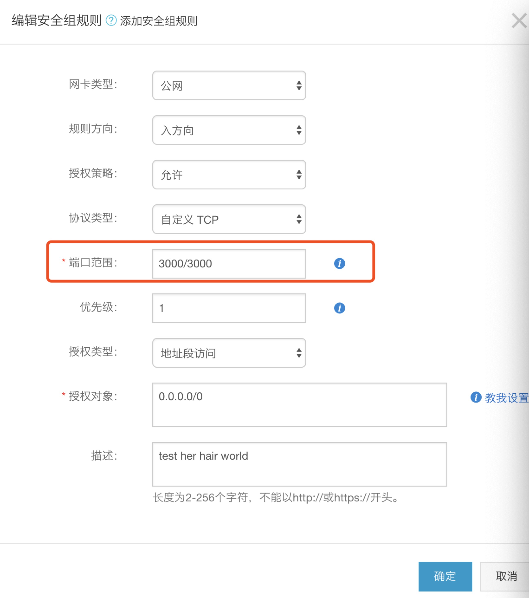
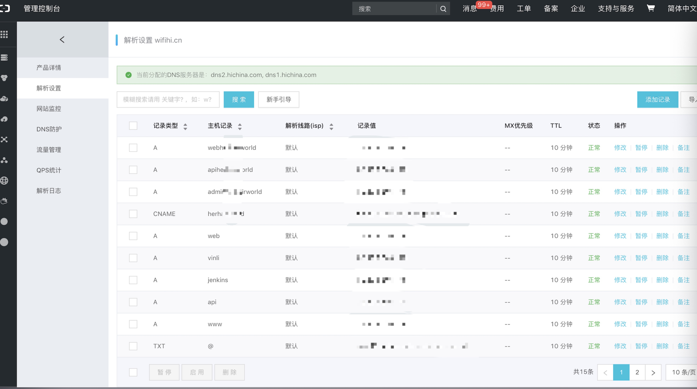

# 阿里云Centos7.4安装Mongodb / Node.js / Git / Nginx

每次新开一台机器部署nodejs项目都会重复这样的部署操作，在这里简单记录一下，方便查阅。

## 安装mongodb

主要参照官方提供的[Installation](https://docs.mongodb.com/manual/tutorial/install-mongodb-on-red-hat/)就可以了，这里简单的记录下过程。

- 创建资源管理文件

```shell
  # 文件：/etc/yum.repos.d/mongodb-org-4.0.repo 

  # 内容：
  [mongodb-org-4.0]
  name=MongoDB Repository
  baseurl=https://repo.mongodb.org/yum/redhat/$releasever/mongodb-org/4.0/x86_64/
  gpgcheck=1
  enabled=1
  gpgkey=https://www.mongodb.org/static/pgp/server-4.0.asc
```

- 更新一下yum资源

`$ sudo yum update -y`

- 安装mongodb

`$ sudo yum install -y mongodb-org`

- 启动mongo服务

`$ service mongod restart`

- 检查是否成功运行

`$ mongd`

成功显示连接成功的信息即表示安装启动成功了.

- 配置外网可访问mongodb

  - mongodb默认端口是27017，需要到阿里云管理后台里面的安全组管理，添加一个安全组规则，端口为：27017
  

  - 登陆到服务器修改mongo的配置
  `$ vim /etc/mongod.conf`
  - 找到bindIp

  ```shell
  # 找到如下内容，修改bindIp
  ...
  net:
    port: 27017
    bindIp: 127.0.0.1
  ...
  ⬇️
  #这是更改后的
  ...
  net:
    port: 27017
    bindIp: ::,0.0.0.0
  ...
  ```

  - 修改成功后，重新启动mongod

  `$ service mongod restart`

  - 验证是否成功
  回到自己的机器，用客户端或者mong连接命令进行连接，注意，这个时候的mongo是没有账户名和密码的，[如何配置账户名密码](#)后续添加。

  ```shell
  # 所以不需要用户名和密码既可以登陆
  $ mongo yourserverip:27017
  ```

  成功显示连接的信息即配置外网访问成功。

## 安装nodejs

nodejs版本更新很快，有时候会存在同时使用多个版本的情况，所以可以用[nvm](https://github.com/creationix/nvm)来管理安装nodejs，方便在需要的时候切换版本。

- 安装脚本

`$ curl -o- https://raw.githubusercontent.com/creationix/nvm/v0.33.11/install.sh | bash`

- 更新一下source文件

`$ source ~/.bashrc`

- 检查是否安装成功

`$ nvm`

成功显示help命令信息则安装成功，若失败参考[官方安装问题解析](https://github.com/creationix/nvm#install-script).

- nvm安装成功之后就可以安装任意版本的nodejs了

  - 安装最新版nodejs
  `$ nvm install node`
  - 安装指定版本，如8.4.0
  `$ nvm install 8.4.0`

- 检查node是否安装成功

`$ node -v`
成功输出版本信息即安装成功。

## 安装Git

同样可以参考官方[installation](https://git-scm.com/book/zh/v1/%E8%B5%B7%E6%AD%A5-%E5%AE%89%E8%A3%85-Git)的安装教程，这个是有中文的，一步一步安装即可，这里简单总结一下。

- 使用yum安装

`$ yum install git-core`

- 检查是否安装成功

`$ git --version`

成功输出版本信息即安装成功，是不是很简单。当然也可以选择用[源码安装](https://git-scm.com/book/zh/v1/%E8%B5%B7%E6%AD%A5-%E5%AE%89%E8%A3%85-Git#%E4%BB%8E%E6%BA%90%E4%BB%A3%E7%A0%81%E5%AE%89%E8%A3%85).

## 安装Nginx

nginx是一个异步框架的Web服务器，也可以用作反向代理，负载平衡器和HTTP缓存，得到广泛的使用。当然nodjs也是可以作为独立服务器运行，并且实现反向代理等功能。

- 使用yum进行安装

`$ yum install nginx`

- 启动nginx
  `$ service nginx start`

  - 其他一些命令：
    - 停止：`$ service nginx stop`
    - 重启：`$ service nginx restart`
    - 检查nginx配置文件：`$ nginx -t`

- 检查是否安装成功
  到自己机器的浏览器输入服务器的ip，成功显示nginx默认页面即表示安装成功了

  - 如果不能成功访问，检查默认的80端口是否有开放；如是阿里与服务器，需要到安全组里配置80端口。

- 配置反向代理
  有了反向代理，可以很轻松实现不同的域名指向不同的服务。
  如：机器同时启动了前端服务(mobile.example.com)、管理端服务(admin.example.com)、api服务(api.example.com)、Jenkins(jenkins.eample.com)等的时候，我们通过配置不同的域名，在nginx配置里面监听80端口，根据不同的域名实现请求转发。

  - 简单添加配置

  ```shell
  # 修改/etc/nginx/nginx.conf，在server同级的地方添加配置
  ...
    server {
        listen       80;
        server_name  mobile.example.com;
        location / {
            proxy_pass http://127.0.0.1:3001;
        }
    }
    server {
        listen       80;
        server_name  admin.example.com;
        location / {
            proxy_pass http://127.0.0.1:3002;
        }
    }
    server {
        listen       80;
        server_name  api.example.com;
        location / {
            proxy_pass http://127.0.0.1:3003;
        }
    }
  ...
  ```

  - 保存配置后使用`nginx -t`进行检查配置文件是否正确
  - 使用`service nginx restart`重启
  - 重启成功后，通过访问对应的域名既可请求对应的服务了；域名解析需要到对应的域名提供商那里设置。下面截图是阿里云里的域名解析设置。
  